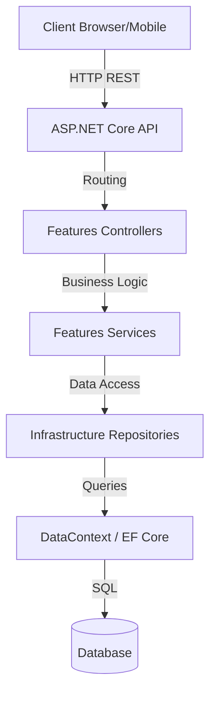

# Technical Architecture: Loutaupia-V2-dotnet-api

## Architecture Overview
L'architecture de **Loutaupia-V2-dotnet-api** repose sur le pattern **Vertical Slice Architecture** combiné à une couche d'infrastructure centralisée. Contrairement aux architectures en couches traditionnelles (N-Tier), cette structure regroupe le code par domaine métier (**Features**), ce qui réduit le couplage entre les différentes parties de l'application.

## Core Patterns
### 1. Vertical Slice Architecture
- Le code est organisé par "Feature". Chaque dossier dans `Features/` contient tout ce dont une fonctionnalité a besoin (Controllers, Services, Modèles de requête/réponse).
- **Avantage** : Facilité de maintenance et d'évolution, isolation des changements.

### 2. Infrastructure & Persistence
- **DataContext** : Situé dans `Infrastructure/`, il gère la connexion à la base de données via **Entity Framework Core** (Hypothèse à confirmer par le scan des modèles).
- **Repositories** : Une abstraction de la couche d'accès aux données est présente dans `Infrastructure/Repositories/`.

### 3. Dependency Injection
- Le framework .NET Core gère nativement l'injection de dépendances, configurée dans `Program.cs`. Les services métier et les contextes de données sont injectés via les constructeurs.

## Architecture Diagram (Mermaid)

## Security Design
- **Authorization** : Implémenté via `app.UseAuthorization()` dans le pipeline HTTP.
- **HTTPS** : Redirection forcée via `app.UseHttpsRedirection()`.
